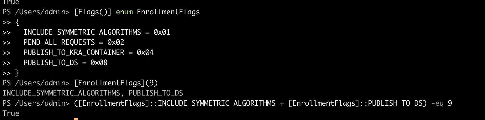

* Script by Marc-Andre to create cert templates programmatically: https://github.com/Devolutions/devolutions-labs/blob/master/powershell/scripts/New-CertificateTemplate.ps1

* API called by MA's script: https://github.com/tpn/winsdk-10/blob/master/Include/10.0.16299.0/um/certca.h#L2134

* FileTime description: https://learn.microsoft.com/en-us/openspecs/windows_protocols/ms-dtyp/2c57429b-fdd4-488f-b5fc-9e4cf020fcdf

```powershell
[System.Security.Cryptography.Oid]::FromFriendlyName("Server Authentication", [System.Security.Cryptography.OidGroup]::EnhancedKeyUsage);
```


```powershell
[Flags()] enum EnrollmentFlags
{
    INCLUDE_SYMMETRIC_ALGORITHMS = 0x01
    PEND_ALL_REQUESTS = 0x02
    PUBLISH_TO_KRA_CONTAINER = 0x04
    PUBLISH_TO_DS = 0x08
}
[EnrollmentFlags](9)
```

Preparation:
1. Create example templates using MA's script. 
    * Naming convention: Example-[VulnType]-[AdditionalInfo]
1. Manually modify example templates as needed.
1. Create blank template object using scripted New-ADObject.
    * Naming convention: [VulnType]-[AdditionalInfo]
1. Capture differences between example and blank templates and export to CliXML.
    * Naming convention: [VulnType]-[AdditionalInfo].xml

Deploy:
1. Create blank template object using scripted New-ADObject.
    * Naming convention: [VulnType]-[AdditionalInfo]
1. Grant Authenticated Users `Enroll` on new template objects.
1. Import difference object from CliXML.
1. Apply difference object to blank template object. 